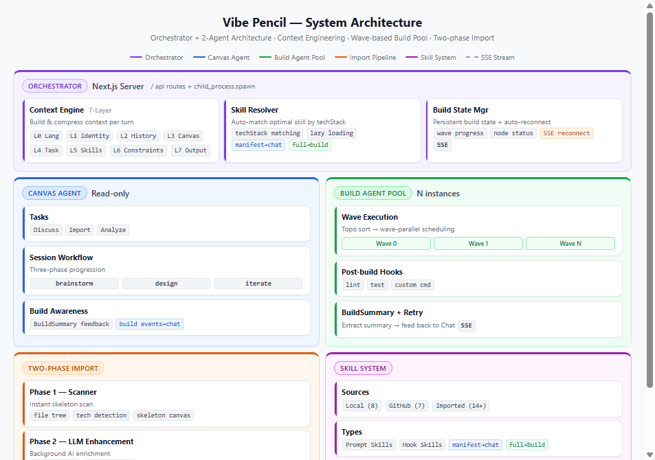
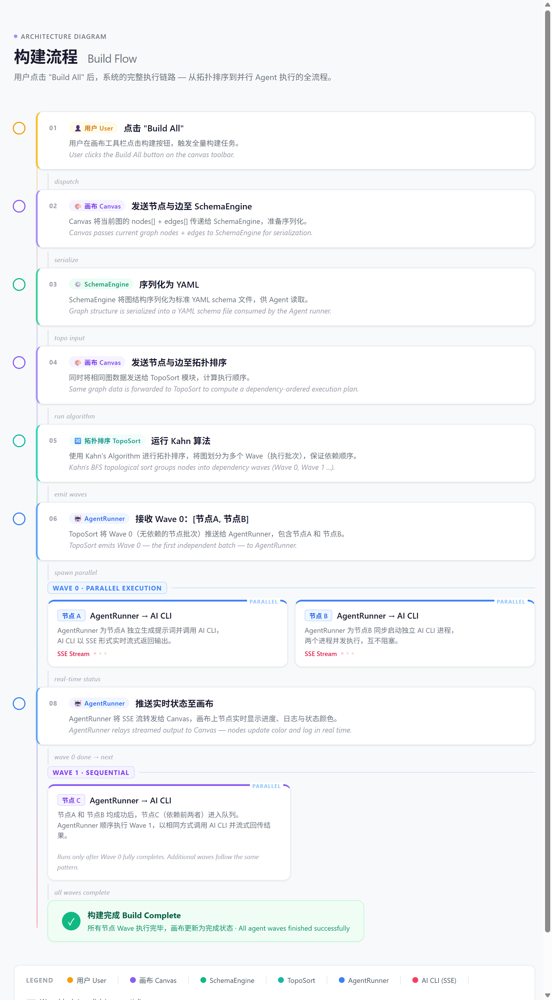
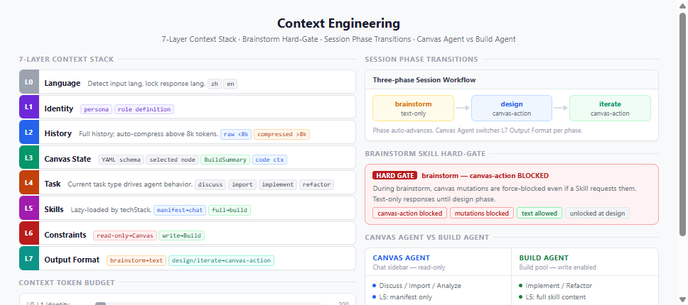
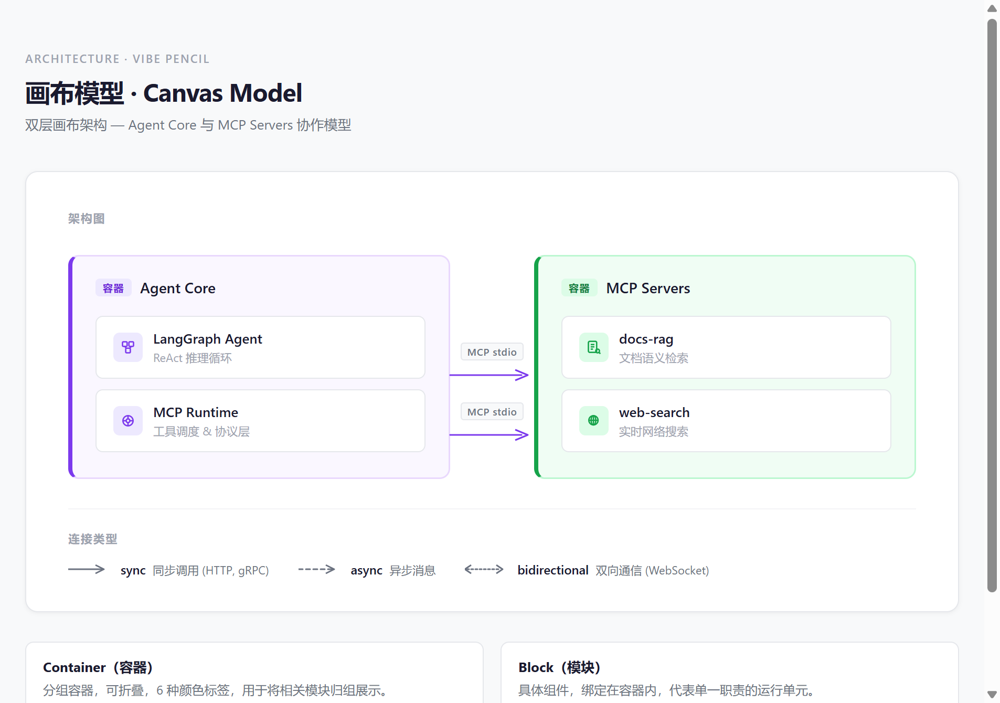

# Vibe Pencil

[中文](README.md) | **English**

**Describe your idea in one sentence. AI designs the architecture, draws it on a canvas, and generates the code.**

Tell the AI "build me a cross-border e-commerce system with product sourcing, ad management, fraud detection, and AI customer service." It asks sharp questions like a senior architect: scraping or API for product sourcing? Which ad platforms to integrate? Rule engine or ML model for fraud detection? Once the design is locked, the architecture diagram appears on the canvas — product sourcing engine, ad manager, fraud center, AI chatbot — containers, modules, edges, all laid out automatically. Then hit Build All, and AI generates code for every module in parallel, respecting dependency order.

**This is not a diagramming tool.** It's an AI architecture partner: from fuzzy idea to runnable code, entirely conversation-driven.

---

## Who is this for?

- **"I have an app idea but can't code"** — PMs, founders, indie creators. Turn ideas into real projects through conversation.
- **"I want to validate an architecture fast"** — Architects. See a complete architecture diagram in 30 seconds — 10x faster than a whiteboard.
- **"I want AI to scaffold my project"** — Developers. Skip the repetitive boilerplate, focus on core logic.

---

## Core Workflow

1. 💬 **"Build me a food delivery app"** — Start with one sentence. AI asks like a senior architect: Where does product data come from? Which ad platforms? Need multilingual customer service?
2. 🧠 **AI brainstorms** — Discusses tech choices, database design, API structure. AI raises questions you hadn't considered, until the plan is solid.
3. 🎨 **Architecture auto-generates** — Containers, modules, and edges appear on the canvas instantly. No dragging, no learning curve.
4. 🔄 **Iterate through conversation** — "Add payment" or "Split the database into read/write replicas" — the architecture updates in real time. Every step is undoable.
5. 🚀 **One-click build** — Topologically sorted, wave-parallel AI code generation. Watch each module's build progress live.

```
"Cross-border         AI brainstorms        Architecture         Iterate via        One-click
 e-commerce"     ──→  asks · decides · ──→  auto-generates  ──→  conversation  ──→  build
 One sentence          confirms               Canvas auto-layout   Live updates       Wave-parallel codegen
```

---

## System Architecture



## Build Flow



## Context Engineering



## Canvas Model



---

## Highlights

| Capability | Why it matters |
|---|---|
| **AI brainstorm workflow** | brainstorm → design → iterate — three phases that progressively refine, not one-shot generation |
| **2-Agent architecture** | Canvas Agent handles design, Build Agent handles construction. 7-layer context stack precisely controls every input layer |
| **Build progress injected into chat** | Build events auto-stream into the conversation; Chat Agent is aware of build state in real time |
| **15+ built-in skills + one-click GitHub import** | Skill system auto-matches the best skill by techStack, with post-build hooks support |
| **Import a codebase, reverse-engineer architecture in seconds** | Two-phase import: instant skeleton scan + background AI enrichment. Works on existing projects too |
| **9 export formats** | YAML / JSON / PNG / Mermaid / Markdown / session backup / project archive / clipboard |

---

## Features

### Canvas & Design

| Feature | Description |
|---|---|
| Container + Block two-layer model | Service-group containers with inner component blocks; elkjs compound layout auto-arranges |
| Resizable containers | Resize handle appears on selection; drag to resize freely |
| 8-direction smart handles | Position-aware edge routing picks the optimal handle pair automatically |
| Typed edges | `sync` (HTTP/gRPC) / `async` (message queue) / `bidirectional` (WebSocket) |
| Undo / Redo | 50-step snapshot stack, `Ctrl+Z` / `Ctrl+Shift+Z` |
| Session-canvas binding | Switching chat sessions auto-saves and restores the corresponding canvas state |

### AI Chat & Workflow

| Feature | Description |
|---|---|
| AI chat | Discuss architecture with AI; AI can directly mutate the canvas (canvas-action) |
| Three-phase session workflow | brainstorm → design → iterate, progressively advancing the project |
| Context Engineering | 7-layer context stack, 2-agent architecture (Canvas Agent + Build Agent) |
| Chat-Build coupling | Chat agent receives live build status; build events are injected into the conversation |
| Markdown rendering | Syntax-highlighted code blocks, GFM tables, inline code |
| Auto-generated session titles | AI summarizes a session title after the first exchange |
| Auto-generated project names | Inferred from architecture content |

### Build System

| Feature | Description |
|---|---|
| Build All | Topological sort → parallel wave scheduling, maximizing concurrency |
| Three AI backends | Claude Code / Codex / Gemini CLI, switchable per project |
| Skill system | 15+ built-in skills + GitHub import + local import; auto-matched by techStack |
| Post-build hooks | Skills can define commands to auto-run after generation (lint, test, etc.) |
| Build progress panel | Real-time wave progress, node animations, witty loading messages |
| Build state resumption | Page refresh recovers in-flight build state automatically |
| SSE real-time stream | Server-Sent Events push build output and status changes as they happen |

### Import / Export

| Feature | Description |
|---|---|
| Two-phase import | Instant skeleton scan + background AI enrichment — reverse-engineers any codebase |
| 9 export formats | YAML / JSON / PNG / Mermaid / Markdown / session backup / project archive / clipboard |

### Other

- **Bilingual i18n** — Chinese and English
- **Inline progress** — StatusBar embeds auto-calculated build progress
- **Auto-save** — Project persists to local workspace automatically

---

## Tech Stack

| Layer | Technology |
|---|---|
| Framework | Next.js 16 (App Router) |
| Canvas | React Flow (`@xyflow/react` v12) |
| Layout engine | elkjs (compound layout) |
| Styling | Tailwind CSS v4 |
| State management | Zustand v5 |
| Streaming | Server-Sent Events (SSE) |
| Agent execution | Node.js `child_process.spawn` |
| Markdown | react-markdown + rehype-highlight + remark-gfm |
| YAML serialization | `yaml` v2 |
| Tests | Vitest v4 + Testing Library |
| Language | TypeScript |

---

## Quick Start

**Prerequisites**: Node.js 20+

```bash
git clone https://github.com/URaux/vibe-pencil.git
cd vibe-pencil
npm install
npm run dev        # http://localhost:3000
```

**Tests**:
```bash
npm test           # run all tests once
npx vitest         # watch mode
```

**Install AI CLI tools** (choose one or more):
```bash
npm install -g @anthropic-ai/claude-code   # Claude Code
npm install -g @openai/codex               # Codex
npm install -g @google/gemini-cli          # Gemini CLI
```

---

## API Reference

| Method | Route | Description |
|---|---|---|
| `POST` | `/api/agent/spawn` | Spawn a single agent or kick off a full BuildAll wave plan |
| `GET` | `/api/agent/status` | Poll status for a given `agentId` |
| `GET` | `/api/agent/stream` | SSE stream of all agent events (status, output, waves) |
| `POST` | `/api/agent/stop` | Kill a running agent |
| `GET` | `/api/agent/build-state` | Retrieve persisted build state for reconnection |
| `POST` | `/api/chat` | SSE streaming chat with canvas context |
| `GET` | `/api/models` | Model list for a given backend |
| `POST` | `/api/project/save` | Save project to disk |
| `POST` | `/api/project/load` | Load project from disk |
| `POST` | `/api/project/scan` | Two-phase import: skeleton scan |
| `POST` | `/api/project/import` | Two-phase import: AI enrichment pass |
| `GET` | `/api/skills/list` | List all available skills |
| `POST` | `/api/skills/add` | Import a skill from GitHub URL or local path |
| `POST` | `/api/skills/resolve` | Match the best skill for a given techStack |
| `POST` | `/api/build/read-files` | Read build artifact files (post-build hooks) |

---

## Architecture Overview

```
User
 │
 ├─ Canvas (Container + Block) ───────────────────────────┐
 │   └─ elkjs auto-layout                                  │
 │                                                         │
 ├─ AI Chat (ChatSidebar)                                  │
 │   ├─ Context Engine (7-layer stack)                     │
 │   ├─ Three-phase workflow (brainstorm / design / iterate)│
 │   └─ canvas-action → one-click apply to canvas ────────┤
 │                                                         │
 └─ Build All (AgentRunner)                                │
     ├─ Topological sort → wave scheduling                 │
     ├─ Skill system (techStack matching)                  │
     ├─ Claude Code / Codex / Gemini CLI                   │
     ├─ SSE real-time progress                             │
     └─ BuildSummary → feeds back into Canvas Agent ───────┘
```

---

## License

MIT
